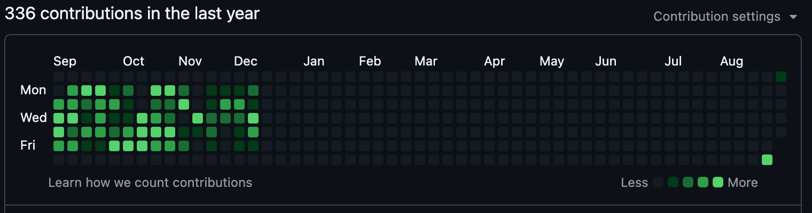
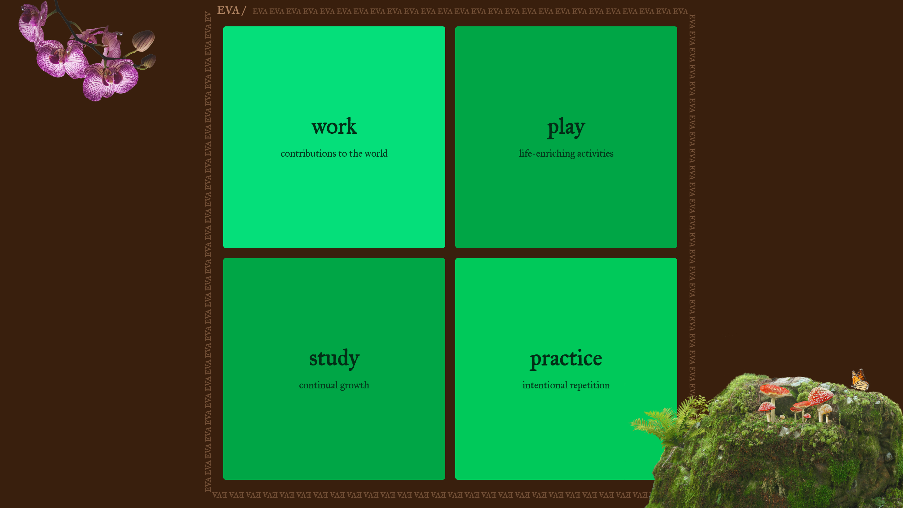

# README

Thanks for checking out my website! 

## First, some context…

After leaving my job as a Software Engineer at the end of 2024, I took a break from coding. Programming had been a consistent part of my life since I started my computer science degree in 2017, then learned how to build applications in 2018. I made side projects, found a way to integrate coding into my non-CS classes, worked as a contracted developer, and even did a COVID hackathon from quarantine. When I graduated, I jumped into the tech workforce and worked at a startup for 3.5 years, contributing to an open-source repository on the side. Then, in 2025, I did an experiment: if I stopped coding, what would step in to fill the space?

Before I quit my job, I wondered if I would get bored. The answer is a definitive, no. I filled the space (and then some) with learning new skills and studying new ideas, becoming involved in my community, play, care, and deepening relationships. At times, I felt unmoored without the routine of a full-time job and the psychological security it granted me. But this discomfort forced me to grapple with my values, what is important for me to spend time on, and why. The months were full of growth and inspiration. 

In July, I picked up a programming project for my tenant union, pulling some open data files into a database and running SQL queries. After the project, I realized those were the first lines of code I had written in 6 months. I also realized the project had energized me, reawakening the technical side of my brain in a way that felt really good. 

In December of 2020, as I was finishing college and applying for jobs, I created a personal website. I LOVE this site, and all the care and creativity I put into it. It struck me that the site is now 5 years old, and lots of life has happened since it was developed. I decided to update my web presence, not by changing or adding to the original site (I like the idea of an archive), but by making a new one. 

After shaking off the rust, and deciding on a fun theme for the side, I was off to the races. I am happy to share my two-thousand-twenty-five website to the world, and to be returning to the creative technologist who is back from a well-deserved and -enjoyed break!

## About the site

The theme for this site is…. “tree”! Many of my adventures in the last six months have been firmly rooted in the physical world. Trees feel symbolic of this, while harkening back to a classic data structure that programmers know and love. (I was itching for some recursion, I guess.)

To move through the site, you will follow thematic branches to leaves of content, describing an important facet of my last 5 years. The leaves contain anecdotes, pictures, links, and ideas—like a resume, but more comprehensive, vulnerable, and human. I enjoyed the reflective act of putting together the content for this site, walking back through my last 5 years and picking out the memories and experiences that feel the most salient. Hopefully it paints a good picture of this era of Eva. 

I wanted the site to be visually playful and interesting, while reinforcing the tree theme. As I iterated on the design, it became more and more tree-like, using a color palette of browns and greens, a font that reminds me of etched letters, fun forest imagery, and thumbnails that looked like tree rings on a stump. I really love how it turned out. 

## Into the weeds…

For those of you who move through technological spaces:

This site was built with Typescript, NextJS (with Static Generation), Tailwind; and deployed with Github Pages.

Some special features:

- The content for my site is stored as an object in `tree-content`. The `generateStaticParams` recursively traverses this tree to create the statically generated pages based on the content. A catch-all page in `[[...slug]]/page.tsx` renders the requested tree node from the URL.  This allows me the flexibility to add new branches and leaves, or modify the tree structure, with no need to change any boilerplate.
- I had a vision for thumbnails of text that wrap around my tree like tree rings, displaying the current path of the node and allowing users to navigate through the branches. This was tricky to get right. The rings are rendered as SVGs and require a fixed size. I use a context to get the window size and calculate the dimensions of the thumbnails, which is needed in several places throughout the app. This also solved a remounting problem that caused an annoying flash as the thumbnails resized.
- The tree is composed on `GridNodes`, which are represent either branches or leaves in the tree, are rendered in a square grid, and are clickable. `GridLeaf`s are full-grid, scrollable containers that render the full content of a leaf. To keep my tree neat, I store the leaf contents in their own files.
- This was my first time using Tailwind for styling, and I really liked it - it made things like flex grids, colors, transitions much more streamlined and easy to integrate.

## Bye!

Check back in 5 years for the next iteration :)